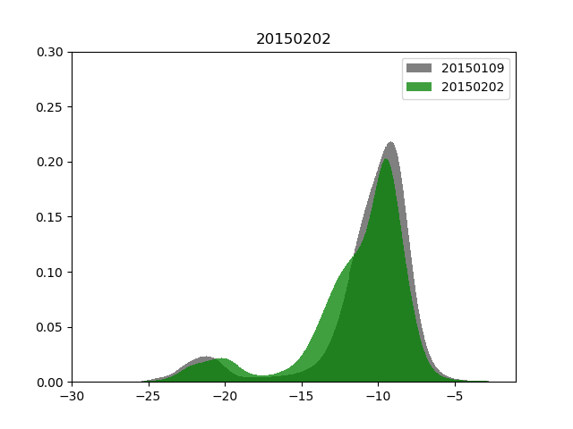

# Floods-monitoring-with-SAR

The detection of flooded areas in SAR satellite images is carried out. A multimodal function is adjusted to the histogram of each SAR image and statistics are obtained that allow the discrimination of the zones.

Satellite Data:
 - Sentinel-1,  SAR in C-Band. Level-1 Ground Range Detected (GRD) product is used in High Resolution (HR) and Interferometric Wide (IW) swath mode. For the study area and the evaluated period is only found VV polarisation. 

Processing:
 -  The GRD images were processed according to the following steps: thermal noise removal, radiometric calibration, terrain correction and convertion to decibels (dB). For which purpose Sentinel Application Platform (SNAP) software with the Sentinel-1 Toolbox (S1TBX) was used (http://step.esa.int/main/toolboxes/snap/). 

Description:

The figure shows the histogram of the satellite images (left) together with the adjusted multimodal function (with its maximums) and the satellite image (right) in which the bodies of water are segmented using information from the histogram.

  
 

  
 

Dependences: 

    python - Numpy
    python - Gdal
    python - Peakutils
    python - Matplotlib
    python - Scipy
    python - Imageio
