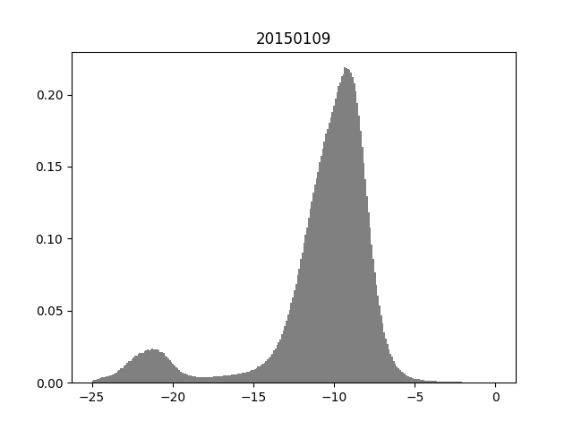

# Floods-monitoring-with-SAR

The detection of flooded areas in SAR satellite images is carried out. A multimodal function is adjusted to the histogram of each SAR image and statistics are obtained that allow the discrimination of the zones.

  
 

Dependences: 

    python - Numpy
    python - Gdal
    python - Peakutils
    python - Matplotlib
    python - Scipy
